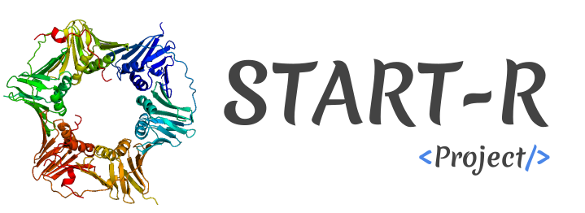

<p align="center"></p>

------

## Requirements


We use Docker to develop and manage START-R. We invite you to verify that the
following requirements are correctly satisfied before trying to bootstrap the
application:

* [Docker 1.12.6+](https://docs.docker.com/engine/installation/)

> We recommend you to follow Docker's official documentations to install
required docker tools (see links above).To help you, explanatory videos for each
operating system are available [here](https://www.bretfisher.com/installdocker/)

**Docker must be on for the duration of START-R use.**

**Important**

Note that the size of the RAM that should be allocated to the Docker depends on
the size of the studied organism genome. START-R can work with data from several
organims. For the Human, we strongly recommend an increase in allocated memory for Docker.
Otherwise, the risk is an early termination of the analysis that will be incomplete.

A workstation or a laboratory server with 16GB of RAM is therefore well dimensioned.
To increase the allocated memory, go here for
- [mac](https://docs.docker.com/docker-for-mac/#memory)
- [windows](https://docs.docker.com/docker-for-windows/#advanced)
- [linux](https://docs.docker.com/config/containers/resource_constraints/#limit-a-containers-access-to-memory)

## Quick start

Have you read the "Requirements" section above?

### START-R project installation

Download the zip file ([here](https://github.com/thomasdenecker/START-R/archive/master.zip)), extract this file and copy the obtained folder where you want on your computer. Note that if you move the folder, the installation procedure will have to be redone.

**Reminder** : Docker must always be switched on for any installation and use of START-R !

#### Windows installation

In this folder, you will find a file named INSTALLATION_WINDOWS.bat. By double clicking on it, the installation will begin. This may take a little time depending on the quality of your internet connection. When the installation will be completed, a new file will appear. They allow to launch the bPeaks application.

#### Mac OsX installation
In this folder, you will find a file named INSTALLATION_MAC.sh. By double clicking on it, the installation will begin. This may take a little time depending on the quality of your internet connection. When the installation will be completed, a new file will appear. They allow to launch the bPeaks application.

**NOTE**

You can also doucle click the file INSTALLATION_MAC_LINUX.sh. In this situation a small manipulation is required (1 time only).
In your Finder, right-click the file INSTALLATION_MAC_LINUX.sh and select "Open with" and then "Other...".

Here you can select the application you want the file to be execute with. In this case it should be the Terminal. To be able to select the Terminal, you have to switch from "Recommended Applications" to "All Applications"  (the Terminal.app application can be found in the Utilities folder).

Check "Always Open With" and after clicking OK you should be able to execute you SHELL script by simply double-clicking it.

#### Linux installation

**In command line**
```
cd PATH/TO/START-R/folder
sudo ./INSTALLATION_LINUX.sh
```
Once the installation is complete, use this command to launch START-R analyzer:
```
sudo ./START-R_analyzer.sh
```

and this command to launch START-R viewer
```
sudo ./START-R_viewer.sh
```

### START-R application utilisation

Double click on START-R file (Windows / MacOS X) or launch the command line (Linux) and open your internet browser, typing the following url: http://localhost:3838/ for START-R analyzer and http://localhost:3839/ fro START-viewer and it should work™. Default user is admin with password : admin. We recommend you to change this password the first time you use it.

**NOTE** (MAC users) : You may need to repeat the same manipulation as for the installation file (only once).

## Development

### Launch in debug mode

During development, you will probably need to have the R outputs in the terminal. Passing through a docker, to have these outputs, you have to access the log file. The following command launches the application and has a log file that will be in the application folder. To help you in the choice of path of the application, you can look in the launch of the application.

START-R analyzer
```
docker run -ti --rm -p 3838:3838 -v YOUR_APPLICATION_PATH:/var/log/shiny-server -v YOUR_APPLICATION_PATH/START-R_analyzer:/srv/shiny-server tdenecker/start-r
```

START-R viewer
```
docker run -ti --rm -p 3838:3838 -v YOUR_APPLICATION_PATH:/var/log/shiny-server -v YOUR_APPLICATION_PATH/START-R_viewer:/srv/shiny-server tdenecker/start-r
```

### Connect to a R session

```
docker run -ti --rm -p 3839:3838 -v YOUR_APPLICATION_PATH:/srv/shiny-server  tdenecker/start-r
```

**Warning**: nothing is saved in this session (package installation, ...)

### Remove folder (Only for linux user) 

To delete an analysis folder, you must use the following command :
```
sudo rm -rf dirName
```

## Citation
If you use START-R project, please cite our paper :


## Contributing

Please, see the [CONTRIBUTING](CONTRIBUTING.md) file.

## Contributor Code of Conduct

Please note that this project is released with a [Contributor Code of
Conduct](http://contributor-covenant.org/). By participating in this project you
agree to abide by its terms. See [CODE_OF_CONDUCT](CODE_OF_CONDUCT.md) file.

## License

START R is released under the BSD-3 License. See the bundled [LICENSE](LICENSE)
file for details.
